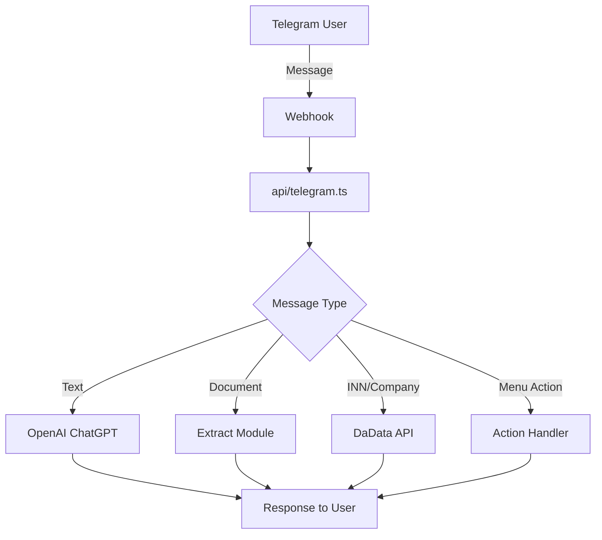

# 👩‍⚖️ Eva Lawyer Bot Ultimate v5.0

> Продвинутый AI-юридический ассистент с обработкой документов, аналитикой и комплексными интеграциями

[](https://vercel.com/new/clone?repository-url=https://github.com/EvaRoksBot/eva-lawyer-bot)
[](https://opensource.org/licenses/MIT)
[](https://nodejs.org/)
[](https://www.typescriptlang.org/)

## 🚀 Возможности

- **🤖 ИИ-консультации** - Юридические консультации на базе GPT-4o-mini
- **📱 Интерактивные меню** - Inline клавиатуры для удобной навигации
- **🔍 Проверка контрагентов** - Реальные данные ЕГРЮЛ через DaData API
- **📄 Анализ документов** - Обработка PDF, DOCX, изображений с OCR
- **📝 Создание документов** - Генерация договоров, счетов, спецификаций
- **⚡ Serverless** - Развертывание на Vercel без сервера
- **🔒 Безопасность** - Проверка webhook секретов и обработка ошибок
- **🛡️ Надежность** - Multi-layer error handling с retry логикой
- **🎯 Специализация** - Отдельные промпты для каждой области права

## 📋 Содержание

- [Быстрый старт](#-быстрый-старт)
- [Архитектура](#-архитектура)
- [Установка](#-установка)
- [Конфигурация](#-конфигурация)
- [Развертывание](#-развертывание)
- [API Reference](#-api-reference)
- [Разработка](#-разработка)
- [Безопасность](#-безопасность)
- [FAQ](#-faq)

## ⚡ Быстрый старт

### 1. Клонирование репозитория
```bash
git clone https://github.com/EvaRoksBot/eva-lawyer-bot.git
cd eva-lawyer-bot
```

### 2. Установка зависимостей
```bash
npm install
```

### 3. Настройка переменных окружения
```bash
cp .env.example .env
# Отредактируйте .env файл с вашими ключами
```

### 4. Развертывание на Vercel
```bash
npm run deploy
```

## 🏗️ Архитектура

```
eva-lawyer-bot/
├── api/                    # Serverless функции Vercel
│   └── telegram.ts         # Основной webhook handler
├── src/                    # Исходный код модулей
│   └── modules/           
│       ├── extract.ts      # Извлечение текста из документов
│       ├── contract.ts     # Генерация договоров
│       ├── counterparty.ts # Проверка контрагентов (DaData)
│       ├── copywriter.ts   # Генерация текстов
│       ├── skills.ts       # Навыки и возможности бота
│       └── appeal.ts       # Обработка обращений
├── docs/                   # Документация
│   └── prompts/           # Системные промпты для ИИ
├── docker/                # Docker конфигурации
├── .github/               # GitHub Actions и шаблоны
│   └── workflows/         # CI/CD пайплайны
├── package.json           # Node.js зависимости
├── tsconfig.json          # TypeScript конфигурация
├── vercel.json            # Конфигурация Vercel
└── README.md              # Этот файл
```

### Поток данных


## 📦 Установка

### Требования
- **Node.js** >= 20.0.0
- **npm** >= 9.0.0
- **TypeScript** >= 5.0.0

### Локальная разработка
```bash
# Установка зависимостей
npm install

# Запуск в режиме разработки
npm run dev

# Сборка проекта
npm run build

# Линтинг кода
npm run lint

# Запуск тестов
npm test
```

## ⚙️ Конфигурация

### Переменные окружения

Создайте файл `.env` на основе `.env.example`:

```env
# Telegram Bot
TELEGRAM_BOT_TOKEN=your_telegram_bot_token
WEBHOOK_SECRET=your_webhook_secret

# OpenAI
OPENAI_API_KEY=your_openai_api_key
OPENAI_MODEL=gpt-4o-mini

# DaData (проверка контрагентов)
DADATA_API_KEY=your_dadata_api_key
DADATA_SECRET_KEY=your_dadata_secret_key

# Vercel
PUBLIC_BASE_URL=https://your-app.vercel.app

# Опционально
NODE_ENV=production
LOG_LEVEL=info
```

### Получение ключей

#### 1. Telegram Bot Token
1. Найдите [@BotFather](https://t.me/botfather) в Telegram
2. Отправьте `/newbot`
3. Следуйте инструкциям
4. Скопируйте токен

#### 2. OpenAI API Key
1. Зарегистрируйтесь на [OpenAI Platform](https://platform.openai.com/)
2. Перейдите в [API Keys](https://platform.openai.com/api-keys)
3. Создайте новый ключ

#### 3. DaData API Keys
1. Зарегистрируйтесь на [DaData](https://dadata.ru/)
2. Получите API ключ и секретный ключ

## 🚀 Развертывание

### Vercel (рекомендуется)

#### Автоматическое развертывание
[](https://vercel.com/new/clone?repository-url=https://github.com/EvaRoksBot/eva-lawyer-bot)

#### Ручное развертывание
```bash
# Установка Vercel CLI
npm i -g vercel

# Вход в аккаунт
vercel login

# Развертывание
vercel --prod
```

#### Настройка webhook
После развертывания настройте webhook:
```bash
curl -X POST "https://api.telegram.org/bot<YOUR_BOT_TOKEN>/setWebhook" \
  -H "Content-Type: application/json" \
  -d '{
    "url": "https://your-app.vercel.app/api/telegram",
    "secret_token": "your_webhook_secret"
  }'
```

### Docker

```bash
# Сборка образа
docker build -t eva-lawyer-bot .

# Запуск контейнера
docker run -p 3000:3000 --env-file .env eva-lawyer-bot
```

### Heroku

```bash
# Создание приложения
heroku create your-app-name

# Настройка переменных окружения
heroku config:set TELEGRAM_BOT_TOKEN=your_token
heroku config:set OPENAI_API_KEY=your_key
# ... другие переменные

# Развертывание
git push heroku main
```

## 📚 API Reference

### Webhook Endpoint

**POST** `/api/telegram`

Обрабатывает входящие обновления от Telegram.

#### Headers
- `Content-Type: application/json`
- `X-Telegram-Bot-Api-Secret-Token: your_webhook_secret`

#### Request Body
```json
{
  "update_id": 123456789,
  "message": {
    "message_id": 1,
    "from": {
      "id": 123456789,
      "first_name": "John",
      "username": "john_doe"
    },
    "chat": {
      "id": 123456789,
      "type": "private"
    },
    "date": 1640995200,
    "text": "/start"
  }
}
```

#### Response
```json
{
  "ok": true
}
```

### Поддерживаемые команды

| Команда | Описание |
|---------|----------|
| `/start` | Запуск бота и показ главного меню |
| `Проверка договора` | Анализ текста договора |
| `Проверка контрагента` | Поиск информации о компании |
| `Создать документ` | Генерация документов |
| `Диалог с ИИ` | Свободное общение с ИИ |
| `FAQ` | Часто задаваемые вопросы |

## 🛠️ Разработка

### Структура кода

#### api/telegram.ts
Основной обработчик webhook с функциями:
- `handler()` - главная функция обработки
- `sendMessage()` - отправка сообщений
- `askAssistant()` - запросы к OpenAI
- `buildMainKeyboard()` - создание клавиатуры

#### src/modules/
Модульная архитектура для различных функций:
- **extract.ts** - извлечение текста из документов
- **contract.ts** - работа с договорами
- **counterparty.ts** - проверка контрагентов
- **copywriter.ts** - генерация текстов
- **skills.ts** - управление навыками
- **appeal.ts** - обработка обращений

### Добавление новых функций

1. **Создайте новый модуль** в `src/modules/`
2. **Экспортируйте функции** с TypeScript типами
3. **Импортируйте в api/telegram.ts**
4. **Добавьте обработку** в функцию `handler()`
5. **Обновите документацию**

Пример нового модуля:
```typescript
// src/modules/example.ts
export interface ExampleRequest {
  text: string;
  userId: number;
}

export interface ExampleResponse {
  result: string;
  success: boolean;
}

export async function processExample(
  request: ExampleRequest
): Promise<ExampleResponse> {
  // Ваша логика здесь
  return {
    result: "Processed successfully",
    success: true
  };
}
```

### Тестирование

```bash
# Запуск всех тестов
npm test

# Запуск с покрытием
npm run test:coverage

# Запуск в watch режиме
npm run test:watch
```

### Линтинг и форматирование

```bash
# Проверка кода
npm run lint

# Автоисправление
npm run lint:fix

# Форматирование
npm run format
```

## 🔒 Безопасность

### Лучшие практики

1. **Никогда не коммитьте секреты** в репозиторий
2. **Используйте переменные окружения** для всех ключей
3. **Проверяйте webhook секрет** для защиты от подделок
4. **Ограничивайте права доступа** API ключей
5. **Регулярно ротируйте ключи**

### Настройка pre-commit хуков

```bash
# Установка husky
npm install --save-dev husky

# Настройка git hooks
npx husky install

# Добавление pre-commit хука
npx husky add .husky/pre-commit "npm run lint && npm test"
```

### Сканирование секретов

```bash
# Установка git-secrets
brew install git-secrets  # macOS
# или
sudo apt-get install git-secrets  # Ubuntu

# Настройка
git secrets --register-aws
git secrets --install
```

## 📊 Мониторинг

### Логирование

Бот использует структурированное логирование:

```typescript
console.log('Info message', { userId, action });
console.error('Error occurred', { error, context });
```

### Метрики Vercel

Отслеживайте производительность в [Vercel Dashboard](https://vercel.com/dashboard):
- Время ответа функций
- Количество запросов
- Ошибки и исключения
- Использование ресурсов

### Алерты

Настройте уведомления для:
- Ошибки развертывания
- Превышение лимитов API
- Подозрительная активность

## ❓ FAQ

### Общие вопросы

**Q: Как обновить бота после изменений в коде?**
A: Просто сделайте push в main ветку - Vercel автоматически пересоберет и развернет новую версию.

**Q: Почему бот не отвечает на сообщения?**
A: Проверьте:
1. Правильность TELEGRAM_BOT_TOKEN
2. Настройку webhook
3. Логи в Vercel Dashboard
4. Переменные окружения

**Q: Как добавить поддержку новых типов документов?**
A: Расширьте модуль `extract.ts` и добавьте обработку в `handler()`.

### Ошибки развертывания

**Q: Ошибка "Module not found"**
A: Проверьте пути импортов и убедитесь, что все модули экспортированы правильно.

**Q: Timeout при обработке документов**
A: Увеличьте `maxDuration` в `vercel.json` или оптимизируйте обработку.

### Производительность

**Q: Как ускорить ответы бота?**
A: 
1. Используйте более быструю модель OpenAI (gpt-3.5-turbo)
2. Кешируйте частые запросы
3. Оптимизируйте размер функций

**Q: Лимиты Vercel**
A: Бесплатный план имеет ограничения:
- 100GB bandwidth/месяц
- 100 serverless function executions/день
- 10 секунд timeout

## 🤝 Участие в разработке

### Как внести вклад

1. **Fork** репозитория
2. **Создайте** feature ветку (`git checkout -b feature/amazing-feature`)
3. **Commit** изменения (`git commit -m 'Add amazing feature'`)
4. **Push** в ветку (`git push origin feature/amazing-feature`)
5. **Откройте** Pull Request

### Стандарты кода

- Используйте **TypeScript** для всего кода
- Следуйте **ESLint** правилам
- Покрывайте код **тестами**
- Документируйте **публичные API**

### Отчеты об ошибках

Используйте [GitHub Issues](https://github.com/EvaRoksBot/eva-lawyer-bot/issues) с шаблоном:

```markdown
**Описание ошибки**
Краткое описание проблемы.

**Шаги воспроизведения**
1. Перейти к '...'
2. Нажать на '....'
3. Прокрутить вниз до '....'
4. Увидеть ошибку

**Ожидаемое поведение**
Что должно было произойти.

**Скриншоты**
Если применимо, добавьте скриншоты.

**Окружение:**
- OS: [e.g. iOS]
- Browser [e.g. chrome, safari]
- Version [e.g. 22]
```

## 📄 Лицензия

Этот проект лицензирован под MIT License - см. файл [LICENSE](LICENSE) для деталей.

## 🙏 Благодарности

- [OpenAI](https://openai.com/) за ChatGPT API
- [Vercel](https://vercel.com/) за serverless платформу
- [DaData](https://dadata.ru/) за API проверки контрагентов
- [Telegram](https://telegram.org/) за Bot API

## 📞 Поддержка

- 📧 Email: support@eva-lawyer-bot.com
- 💬 Telegram: [@EvaLawyerSupport](https://t.me/EvaLawyerSupport)
- 🐛 Issues: [GitHub Issues](https://github.com/EvaRoksBot/eva-lawyer-bot/issues)
- 📖 Docs: [Documentation](https://eva-lawyer-bot.vercel.app/docs)

---

<div align="center">

**[⬆ Наверх](#-eva-lawyer-bot)**

Made with ❤️ by [EvaRoksBot Team](https://github.com/EvaRoksBot)

</div>

